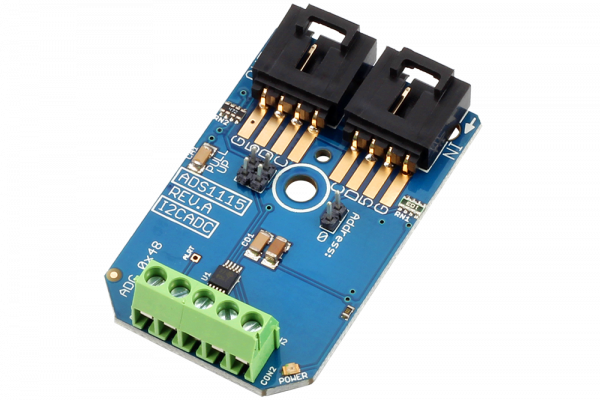

[](https://store.ncd.io/product/ads1115-16-bit-4-channel-precision-analog-to-digital-converter-i2c-mini-module/).

# ADS1115
ADS1115 16-Bit 4-Channel Precision Analog to Digital Converter I2C Mini Module.

This Device is available from www.ncd.io [SKU: ADS1115_I2CS].
(https://store.ncd.io/product/ads1115-16-bit-4-channel-precision-analog-to-digital-converter-i2c-mini-module/).
This Sample code can be used with Raspberry Pi.

Hardware needed to interface ADS1115 16-Bit 4-Channel ADC With Raspberry Pi : 
1. <a href="https://store.ncd.io/product/ads1115-16-bit-4-channel-precision-analog-to-digital-converter-i2c-mini-module/">ADS1115 16-Bit 4-Channel Precision Analog to Digital Converter</a>
2. <a href="https://store.ncd.io/product/i2c-shield-for-raspberry-pi-3-pi2-with-outward-facing-i2c-port-terminates-over-hdmi-port/">Raspberry Pi I2C Shield</a>
3. <a href="https://store.ncd.io/product/i%C2%B2c-cable/">I2C Cable</a>

## Python

Download and install smbus library on Raspberry pi. Steps to install smbus are provided at:

https://pypi.python.org/pypi/smbus-cffi/0.5.1
Download (or git pull) the code in pi. Run the program.

```cpp

$> python ADS1115.py

```

The lib is a sample library, you will need to calibrate the sensor according to your application requirement.

